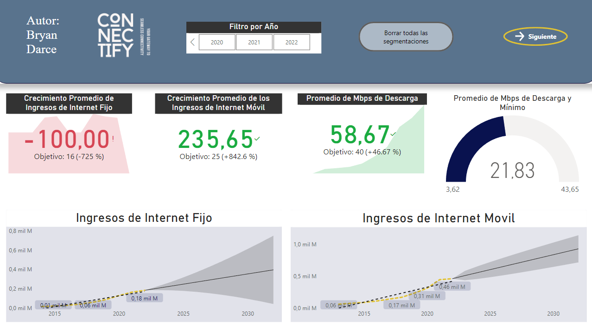
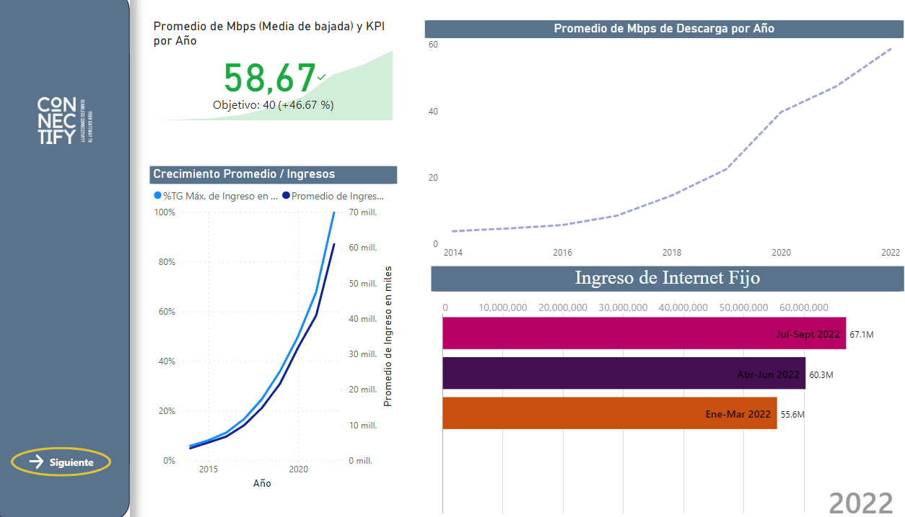
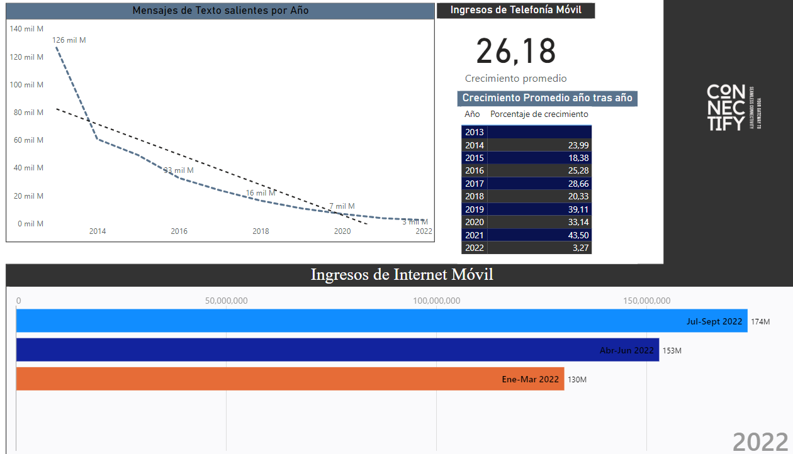

  

 
<h1 align="center"> PROYECTO INDIVIDUAL N°2 💥</h1>

<h2 align="center">Data Analytics</h2>
  

  

  

<h2 align="center">Connectify</h2>
<h3 align="center"> Your gateway to seamless connectivity </h3>

## Resumen 📃 

En el dinámico y competitivo mundo de las telecomunicaciones, las empresas prestadoras de servicios juegan un papel crucial en la conectividad de las personas y en el desarrollo de la sociedad. En este contexto, Connectify, una startup argentina, se ha posicionado como un actor prometedor en el sector.

Con un enfoque innovador y una visión vanguardista, Connectify busca ofrecer una experiencia integral a sus clientes, abarcando no solo el acceso a internet, sino también otros servicios de comunicación. Nuestro objetivo es proporcionar una visión completa del panorama de las telecomunicaciones, permitiendo a Connectify mejorar la calidad de sus servicios y adaptarlos a las necesidades específicas de sus potenciales clientes.

<blockquote style="background-color:; padding: 10px;">

Como aliados estratégicos de Connectify, nuestro objetivo es proporcionar el análisis y la orientación necesaria para que la empresa pueda tomar decisiones informadas. 
A través de la comprensión profunda del comportamiento del sector, podremos colaborar en la identificación de oportunidades de crecimiento y en el diseño de soluciones que brinden un valor diferencial a los clientes de Connectify.

</blockquote>

## Pasos del proyecto 📚
### 1. Extracción, Transformación, Carga ( [ ETL ](https://github.com/BryanDarce01/PI_DA/blob/master/ETL_Internet.ipynb))

  Se llevó a cabo el proceso de extracción de datos, la transformación de los datos para su limpieza y carga de los datos para tenerlos listos para el análisis explotario.

### 2. Análisis Exploratorio de Datos ( [ EDA ](https://github.com/BryanDarce01/PI_DA/blob/master/EDA_Internet_FIjo.ipynb))

  En este paso se exploran los datos para tener un mejor entendimiento de la información que contiene cada archivo y se grafican los datos más relevantes. 

  A través de gráficos y visualizaciones, se destacan los aspectos más relevantes y se presentan de manera clara y concisa. Este proceso de exploración y visualización de datos nos permite obtener insights valiosos y generar conocimientos que servirán como base para el análisis posterior

###  3. Power BI ([ Dashboard ](https://github.com/BryanDarce01/PI_DA/blob/master/src/Dash.png))

En esta presentación el enfoque fue hacia una comparativa de los Ingresos de Internet Fijo contra los Ingresos de Internet Móvil, y ver los Mbps (megabits por segundo) y su comportamiendo a lo largo de los años y ver como estas son áreas de oportunidad para Connectify y así tomar mejores decisiones a la hora de invertir. 

  

En el segundo gráfico, se detalla más la información sobre los Ingresos del Internet Fijo y como este ha ido de la mano creciendo con los Mbps, esto puede tener varias causas, por ejemplo, la necesidad de estar más conectados a los servicios de streaming que ofrecen las empresas de tecnología, así como la normalización del trabajo remoto en varias partes del mundo y la inversión en infraestructura para poder proveer el servicio de Internet en zonas donde antes no se contaba.

  

Y por último en el tercer gráfico, se detalla más la información sobre los Ingresos del Internet Móvil y como este ha tenido un crecimiento exponencial en los últimos años, pudiendo tener varias causas, por ejemplo la necesidad de tener una conexión de alta velocidad con bastante covertura en distintas zonas que permita a la población estar conectada en cualquier momento y a su vez se compara con la caía abismal de los Mensajes de Texto (SMS), teniendo estos últimos, un reemplazo por las nuevas formas de comunicación instantáneas.

Reflejando como es que las empresas de Telecomunicaciones se adaptan a las necesidades de los usuarios y obteniendo ganancias de miles de dólares.

  

# Stack Tecnológico 👨‍💻

 

  🐍**Python**: Lenguaje de programación principal utilizado en el desarrollo del proyecto.

  🐼**Pandas**: Utilizado para la manipulación y análisis de datos estructurados.

  📈**Matplotlib**: Utilizado para la visualización de datos y generación de gráficos.
  
  💻**Power BI**: Herramienta de visualización y análisis de datos, se utilizó para transformar datos complejos en información significativa y comprensible, lo que permite tomar decisiones basadas en datos de manera más efectiva.

  # [Fuente de los datos](https://datosabiertos.enacom.gob.ar/home)

  # Contacto 📱
[Bryan Darce](https://www.linkedin.com/in/bryan-darce/)
